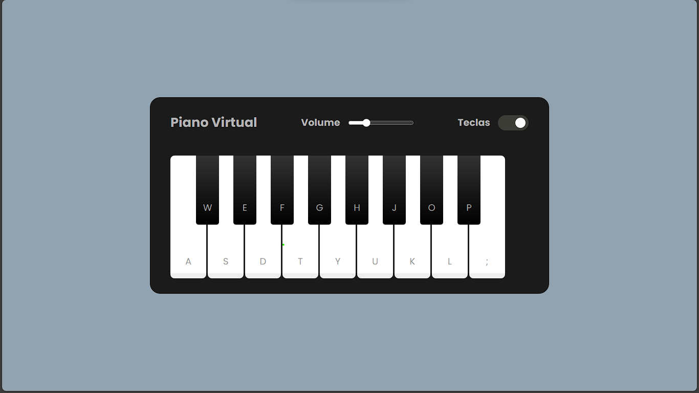

## Teclado_VirtualJS

### Tecnologias Utilizadas
- HTML5 e CSS3 para a estrutura e aparência do jogo.
- JavaScript para a lógica de programação e interatividade.

### Funcionalidades 

- **Musica**: Cada tecla tem seu tom e pode ser tocada tanto com o mouse quanto com o teclado, divirta-se criado musica!
- **Volume**: Volume alterável com slider

### Como Jogar

1. Clone este repositório para sua máquina local.
2. Abra o arquivo `index.html` em seu navegador web.
3. Com o mouse ou teclado toque as notas

### Contribuição

Contribuições são bem-vindas! Se você deseja melhorar este jogo, adicionar novos recursos ou corrigir problemas, sinta-se à vontade para abrir um _pull request_.

### Créditos

Este jogo foi desenvolvido como parte de um projeto educacional da Digital Innovation One.

---

Lembre-se de conferir o repositório original [aqui](https://github.com/felipeAguiarCode/js-music-keyboard-virtual/tree/main) e deixar uma ⭐️ se você gostou do projeto!
